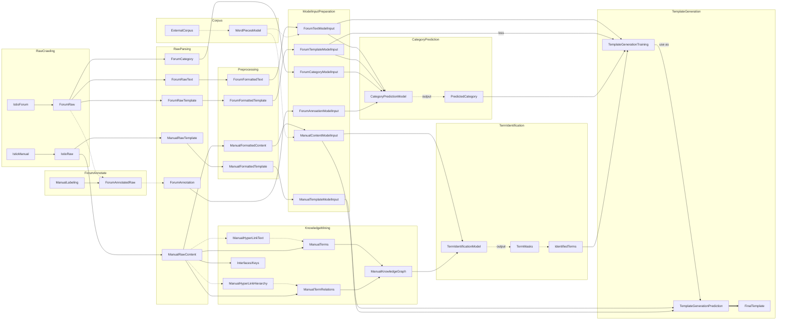

# Istio Template Recommendation Project

## Installation

First, you should clone the repo and install the dependencies.

```shell
git clone https://github/xcdu/istio.git ./istio
cd istio
pip install -r requirement.txt
```

## Usage

This project contains the following steps in sequence: *Corpus Crawling (Optional)*, *Corpus Parsing*, *Preprocessing*
, *Model Training*, and *Input Prediction*.

### Simple example

**(TBD)**

### Corpus Crawling (Optional)

To use scrapy-splash, you need to install and run [scrapy-splash](https://github.com/scrapy-plugins/scrapy-splash)
docker by :

```shell
docker run -p 8050:8050 scrapinghub/splash
```

Then running `python crawldocs/main_docspider.py` can crawl all the necessary corpus
from [Istio Documentations](https://istio.io/latest/docs/).

If you don't use the data crawled by your own, you can check the data set under `.raw_data`.

### Corpus Parsing

`parse_corpus` provides support for other modules. You can check the example usage under test folder.

### Preprocessing

#### Preprocessing Istio Docs

To accelerate the following steps, we can parse istio docs and serialize them into the necessary data in advance.

Run `python parse_corpus/parse_docs/main_parse_manual.py` to convert istio doc files under `.raw_data/istio_docs` to a
formatted dict `.processed_data/parsed_docs`.

#### Preprocessing Forum

You can run `python preprocess_corpus/main_format_forum.py` to convert raw forum
corpus (`.raw_data/forum/raw_forum.csv`) into the preprocessed
one (`.processed_data/preprocessed_corpus_and_forum/preprocessed_forum.pickle`)

If you don't want to crawl the data, you can fetch our experimental data from: **(TBD)**

### Model Training

#### Seq2seq model
To train seq2seq model, make sure `.processed_data/preprocessed_corpus_and_forum/preprocessed_forum.pickle` exists.

Then run `python models/seq2seq/seq2seq_train.py` to train the model.

### Note

Currently, the source codes are tested in [PyCharm](https://www.jetbrains.com/pycharm/). Please add *components", "
crawldocs", "models", "parse_docs", and "preprocess_corpus" directories as source root.

If you want to run the scripts in CLI directly, you shall add those directories to system path.

## Introduction

### Architecture

The structure of the project mainly contains four stages: **crawling**, **parsing**, **preprocessing**, and **modeling**
.



### Modules

#### Crawling

#### Parsing

#### Preprocessing

#### Modeling

