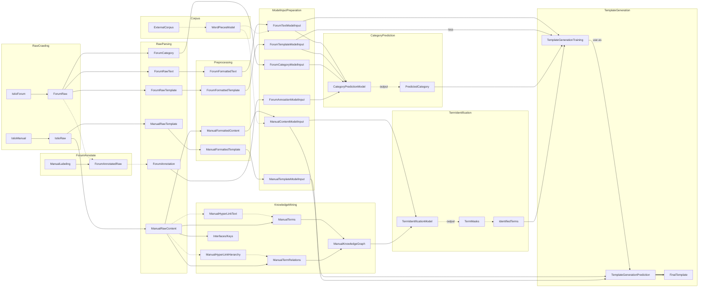

# Istio Template Recommendation Project
## Installation
First, you should clone the repo and install the dependencies.

```shell
git clone https://github/xcdu/istio.git ./istio
cd istio
pip install -r requirement.txt
```

Then you can fetch our experimental data by:

**(TBD)**

(Optional) To use scrapy-splash, you need to install and run [scrapy-splash](https://github.com/scrapy-plugins/scrapy-splash) docker by :

```shell
docker run -p 8050:8050 scrapinghub/splash
```


## Introduction
### Architecture

The structure of the project mainly contains four stages: **crawling**, **parsing**, **preprocessing**, and **modeling**.



### Modules
#### Crawling

#### Parsing

#### Preprocessing

#### Modeling


